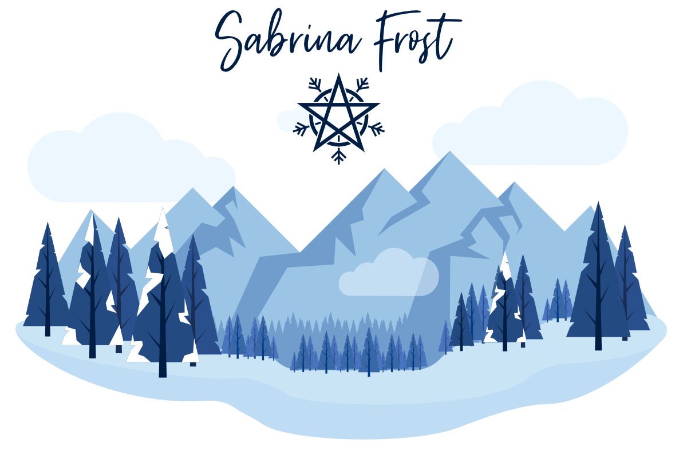

This repository serves as the central location for my web projects. I use it as a platform for testing new technologies and brushing up on old ones. I'm currently using...

-   **[Express.js](https://expressjs.com):** Fast, unopinionated, minimalist web framework for Node.js
-   **[Jest](https://jestjs.io):** Delightful JavaScript Testing
-   **[Supertest](https://github.com/visionmedia/supertest):** Super-agent driven library for testing node.js HTTP servers using a fluent API
-   **[GitHub Actions](https://github.com/actions):** Continuous Integration
-   **[Heroku](https://www.heroku.com):** Deployment and Cloud Application Platform

## 

My personal landing page. At the moment it's just a glorified business card and not integrated with this project.

## 

An API for the various tools I create for myself. The central focus is around Tesla automation and configuration encryption for use with Siri Shortcuts or other projects where I'd rather not store my access token in plain text.

### 

-   [Original banner artwork](https://www.vecteezy.com/vector-art/183044-flat-design-vector-winter-landscape)
